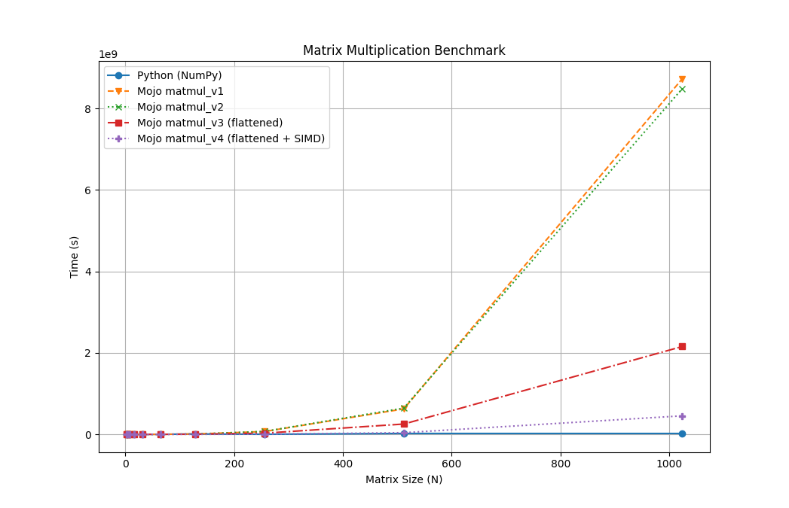
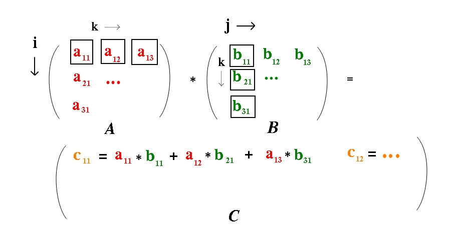

# matmul_mojo

An implementation of matrix multiplication in Mojo

## TLDR

Mojo is fast! And it is quite easy (although not too easy) to use this speed to your advantage.
For example, I re-implemented matrix multiplication in Mojo in several different ways, from the naive to a memory-optimized version that can roughly keep up with numpy!

Here are the results of my endeavour:



As can be seen, the v1 and v2 (which are basically the same, naive nested-for-loop implementations) have pretty poor scaling.
But if you introduce flattening, the performance increases drastically. And if you then add SIMD operations (a neat Mojo feature as well), then you can almost keep up with numpy performance for 1000x1000 matrices!

## Setup

If you have not done so, you can install mojo together with the modular package via pixi.
You can get pixi here: 

   https://pixi.sh/latest/installation/

You can check if pixi was installed successfully, by running:

    pixi --version

If the pixi command is not found, try closing and re-opening your shell.
Then, clone the repo and setup your virtual environment:

    git@github.com:llinauer/matmul_mojo.git
    cd matmul_mojo
    pixi install

Check if you have correctly installed mojo with:

    pixi run mojo --version

If you get a valid output, you are ready to go.


## The long story

I wanted to play around with Mojo for some time, however it seemed pretty scary at first. Although it looks like Python on the surface, it has a very different feel. Suddenly, type hints are not optional anymore, there is this `fn` function definition and how do you even plot stuff?!
But, then I remembered, you can always start slow and then build up later. So I decided to start with a very basic concept. Matrix multiplication.
And started implementing matrix multiplication in the most basic form. As nested for loops.

### Matrix Multiplication v1

The version 1 of my Matrix multiplication is really just a threefold nested for-loop:

```python
    for j in range(cols):
        for i in range(rows):
            for k in range(len(A)):
                C[i][j] += A[i][k]*B[k][j]
```

And here is what that looks like graphically:



The outer loop (j) goes over the columns of B, the inner loop (i) over the rows of A and the innermost loop connects the columns of A with the rows of B (which need to be equal in number for the matrix multiplication to work).

This is (relatively) easy to understand, but not the most efficient way of doing matrix multiplication.